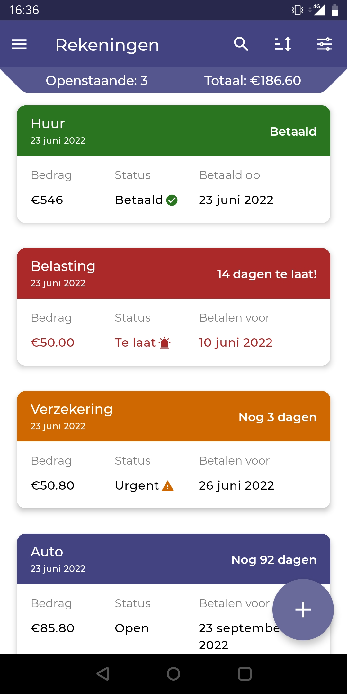
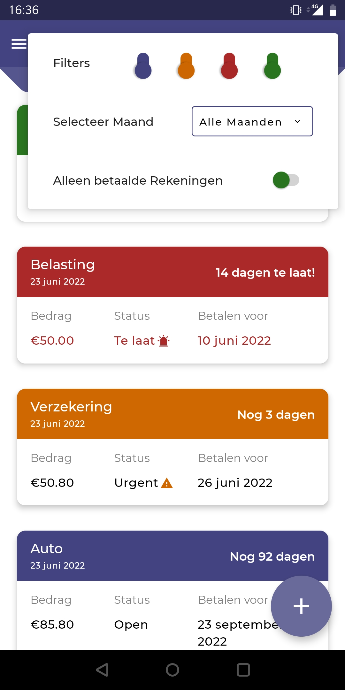
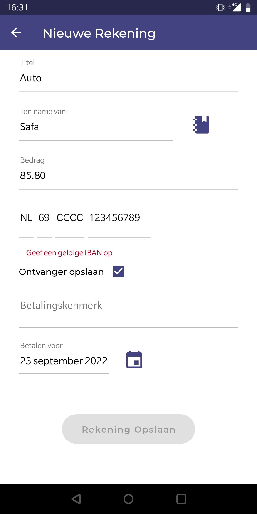
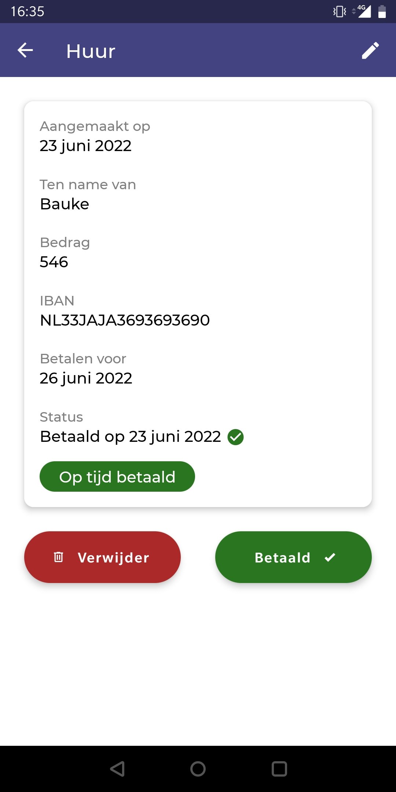

# BillAlert
> Eenvoudig Rekeningen opslaan en reminders instellen om op tijd te betalen. 
> Live expo demo [_here_](https://expo.dev/@sjaakvanlenten/weatherApp).

## Table of Contents
* [Technologies Used](#technologies-used)
* [Screenshots](#screenshots)

## Technologies Used
- React Native Expo - version 44.0
- React Navigation - version 6
- React Native Paper - version 4.8
- Redux - version 4

## Screenshots

  

  &nbsp;&nbsp;&nbsp;&nbsp;&nbsp;&nbsp;&nbsp;&nbsp;&nbsp;&nbsp;&nbsp;&nbsp;

